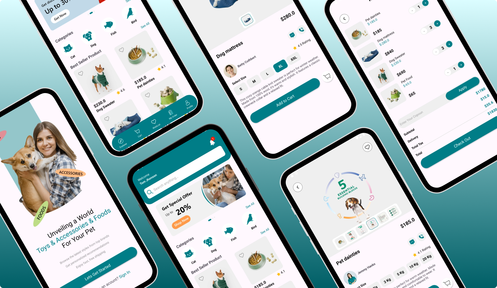

# 📱 PeShop - Aplicación de Productos

**PeShop** es una aplicación móvil desarrollada en **Kotlin** utilizando **MVVM** y **Clean Architecture**. La aplicación obtiene información sobre productos desde **Firebase Realtime Database** y almacena el carrito de compras localmente utilizando **TinyDB**.

<p align="center">
  
</p>

## 📌 Características

✅ Visualización de productos con capacidad para ver los detalles de cada artículo.

✅ Banner deslizable para mostrar productos destacados o promociones.

✅ Gestión del carrito de compras utilizando **TinyDB** (almacenamiento local).

✅ **Firebase Realtime Database** para obtener información sobre los productos (como nombres, descripciones, precios, etc.).

✅ Implementación de **MVVM** y **Clean Architecture** para una arquitectura modular y escalable.

✅ **Interfaz de entrada** al iniciar la aplicación para mejorar la experiencia del usuario.

## ⚙️ Tecnologías y Librerías

| Tecnologías / Librerías | Descripción |
| --- | --- |
| **Kotlin** | Lenguaje principal de desarrollo. |
| **MVVM (ViewModel, LiveData/StateFlow)** | Arquitectura utilizada para separación de lógica. |
| **Hilt** | Inyección de dependencias. |
| **Coroutines / Flow** | Manejo de datos en segundo plano. |
| **Firebase Realtime Database** | Base de datos en tiempo real utilizada para obtener información de productos. |
| **Firebase Storage** | Almacenamiento en la nube para imágenes de productos. |
| **TinyDB** | Almacenamiento local para el carrito de compras. |
| **Glide** | Carga de imágenes eficiente. |
| **RecyclerView** | Listado dinámico para productos y categorías. |

---

## 📲 Instalación y Ejecución

### **1️⃣ Clonar el repositorio**

```
git clone https://github.com/tu-usuario/PeShop.git
cd PeShop
```

### **2️⃣ Abrir en Android Studio**

- Abre **Android Studio** y selecciona "Open an Existing Project".
- Elige la carpeta del proyecto y espera a que se configure.

### **3️⃣ Configuración de Firebase**

- Crea un proyecto en Firebase Console.
- Agrega tu aplicación Android a Firebase en la consola de Firebase.
- Descarga el archivo **`google-services.json`** y colócalo en la carpeta **`app/`** del proyecto.
- Asegúrate de agregar las dependencias de Firebase en tu archivo `build.gradle`.

### **4️⃣ Configuración de TinyDB**

- **TinyDB** se utiliza para almacenar el carrito de compras localmente. No es necesario hacer configuración adicional para esta funcionalidad.

### **5️⃣ Compilar y ejecutar**

- Conecta un **emulador** o un **dispositivo físico**.
- Haz clic en **Run ▶** para ejecutar la app.